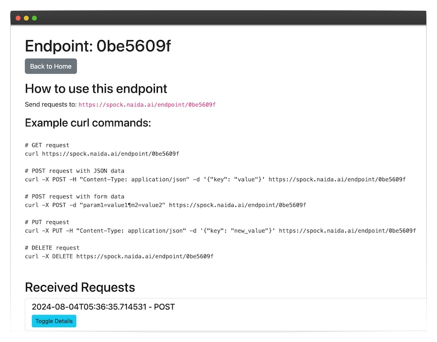

# Spock: API Request Inspector 🖖🏽

Spock is a powerful, easy-to-use tool for inspecting and debugging API requests and webhooks. It provides a simple web interface for creating custom endpoints and examining incoming HTTP requests in real-time.

## Features

- Create custom endpoints on the fly
- Inspect all incoming HTTP requests (GET, POST, PUT, DELETE, PATCH)
- View request headers, query parameters, form data, and raw body
- Real-time updates as requests come in
- Easy-to-use web interface
- Support for both HTTP and HTTPS (via ngrok)

## Installation

1. Clone the repository:
   `git clone https://github.com/u1i/spock.git`
   cd spock

2. Install the required dependencies:
   `pip install -r requirements.txt`
   

## Usage

1. Start the Spock server:
   `gunicorn --bind 0.0.0.0:8080 wsgi:app`

2. Open your web browser and navigate to http://localhost:8080

3. Click "Create New Endpoint" to generate a unique URL for receiving requests

4. Use the generated URL in your API calls or webhook configurations

5. Watch incoming requests appear in real-time on the Spock interface

## Docker Image

[Docker Hub](https://hub.docker.com/r/u1ih/spock)

`docker run -d -p 8080:8080 u1ih/spock`

## HTTPS Support with ngrok

To use Spock with HTTPS:

1. Install ngrok from https://ngrok.com/download

2. Start Spock, and set the HTTPS flag `docker run -d -p 8080:8080 -e USE_HTTPS=true u1ih/spock`

3. In a new terminal window, run:
   ngrok http 8080

4. Use the HTTPS URL provided by ngrok for your API calls

Or use caddy & docker-compose.

## Contributing

Contributions are welcome! Please feel free to submit a Pull Request.

## License

This project is licensed under the MIT License - see the [LICENSE.md](LICENSE.md) file for details.

## Acknowledgments

- Inspired by the need for a simple, self-hosted request inspection tool
- Built with Flask and Bootstrap
- Named after the logical and analytical Vulcan, Mr. Spock, from Star Trek
